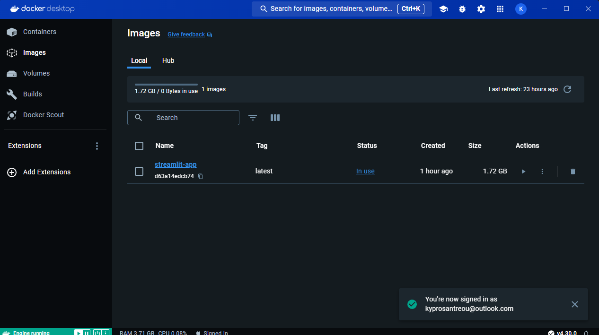
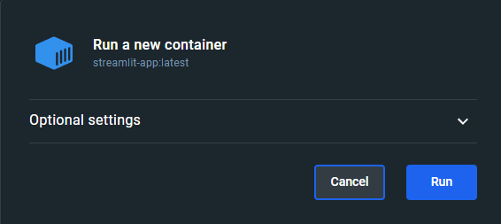
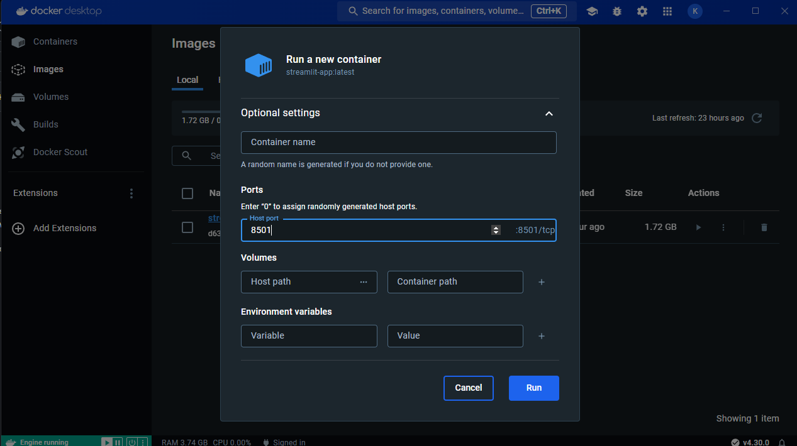

## Ομάδα:

- Κύπρος Ανδρέου (inf2021002)
- Ελένη Γιαννούχου (inf2021041)
- Παναγιώτης Κλεάνθους (inf2021005)

## Πώς να τρέξετε την εφαρμογή:
- Ανοίξτε το τερματικό και πλοηγηθείτε στον φάκελο του έργου.
- Εκτελέστε την εντολή για να δημιουργήσετε το κοντέινερ: docker build -t <image_name> .
- Εκτελέστε την εντολή για να τρέξετε την εφαρμογή: docker run -p 8501:8501 <image_name> 
- Ανοίξτε τον περιηγητή σας και μεταβείτε στην ακόλουθη διεύθυνση URL για να αποκτήσετε πρόσβαση στην εφαρμογή: http://localhost:8501
-  Μπορεί να χρειαστέι να κάνετε την εξής διαδικασία μώ του docker desktop:
-  Ανοίξτε το docker desktop και μεταβήτε στο images
-  Πατήστε στο optional settings και κάντε τα παρακάτω βήματα όπως στις φωτογραφίες.
-  Τέλος πατήστε run και μπήτε στο link http://localhost:8501

